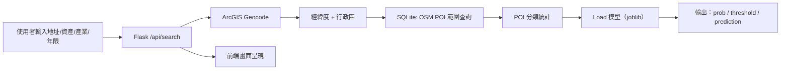

# 🧭 新創店家存活率預測系統（台灣）  
> Address → Geocode → 周邊 POI 機能統計 → 多年期存活率預測（Flask Web Demo）

[](#)
[](#)
[](#)

---

## 目錄
- [系統介紹](#系統介紹)
- [功能特色](#功能特色)
- [技術架構](#技術架構)
- [專案結構](#專案結構)
- [快速開始](#快速開始)
- [API 說明](#api-說明)
- [資料與模型](#資料與模型)
- [常見問題](#常見問題)
- [Roadmap](#roadmap)
- [授權](#授權)

---

## 系統介紹

本專案提供一個 **Web 介面**：使用者輸入「台灣地址」、營運資產、產業別與欲預測年限（3/5/7/10/15 年），系統會：

1. **地址地理編碼**（ArcGIS）取得經緯度、縣市/行政區  
2. 以指定半徑（預設 500m）查詢 **OSM POI 本機資料庫（SQLite）**，統計周邊機能分布  
3. 將特徵輸入對應年限的模型，輸出 **存活機率與判定結果**

---

## 功能特色

- ✅ **一鍵查詢**：輸入資料 → 看見 geocode / POI / 預測結果
- ✅ **完全本機 POI**：OSM POI 以 SQLite 存放，查詢快速、便於離線/內網環境
- ✅ **多年份模型**：3 / 5 / 7 / 10 / 15 年預測（同一套 API）
- ✅ **結果可解讀**：同時回傳門檻值 threshold、概率 prob 與最終 label

---

## 技術架構



---

## 專案結構

> 典型放置方式（依 import 與路徑慣例）

```text
.
├─ app.py
├─ geo/
│  ├─ geocode_arcgis.py
│  ├─ osm_get.py
│  └─ osm_poi.sqlite3              
├─ models/
│  ├─ survival_predict.py
│  ├─ survival_model_3years.pkl     
│  ├─ survival_model_5years.pkl
│  ├─ survival_model_7years.pkl
│  ├─ survival_model_10years.pkl
│  └─ survival_model_15years.pkl
├─ templates/
│  └─ index.html
└─ static/
   ├─ main.js
   └─ style.css
```

---

## 快速開始

### 1) 建立環境 & 安裝依賴

```bash
python -m venv .venv

# macOS / Linux
source .venv/bin/activate
# Windows
# .venv\Scripts\activate

pip install flask requests pandas joblib
```

### 2) 準備資料庫與模型

- 放入 **POI SQLite**：`geo/osm_poi.sqlite3`
- 放入 **模型檔（joblib pkl）**：`models/` 底下，檔名需符合：
  - `survival_model_3years.pkl`
  - `survival_model_5years.pkl`
  - `survival_model_7years.pkl`
  - `survival_model_10years.pkl`
  - `survival_model_15years.pkl`

> 若模型檔/DB 不存在，API 會回傳對應錯誤訊息。

### 3) 啟動服務

```bash
python app.py
```

打開瀏覽器：`http://127.0.0.1:5000`

---

## API 說明

### `POST /api/search`

#### Request JSON
```json
{
  "address": "100臺北市中正區館前路2號",
  "total_asset": 1000000,
  "industry": "industry_飲料店業",
  "model_year": 5,
  "radius_m": 500
}
```

- `address`（必填）：台灣地址
- `total_asset`：總資產（數值）
- `industry`：產業別（前端下拉選單對應字串）
- `model_year`：模型年限（只支援 3/5/7/10/15；其餘會自動回落至 5）
- `radius_m`：查詢半徑（公尺，預設 500）

#### cURL 範例
```bash
curl -X POST http://127.0.0.1:5000/api/search \
  -H "Content-Type: application/json" \
  -d '{"address":"100臺北市中正區館前路2號","total_asset":1000000,"industry":"industry_飲料店業","model_year":5}'
```

#### Response（節錄示意）
```json
{
  "ok": true,
  "geocode": {
    "matched_address": "台北市中正區館前路2號, 10047",
    "score": 100,
    "lat": 25.0464,
    "lng": 121.5148,
    "city": "臺北市",
    "district": "中正區"
  },
  "result": {
    "summary": {
      "fuel": 1,
      "transit": 18,
      "school": 2,
      "parking": 5,
      "scenic": 9,
      "cinema": 1
    }
  },
  "survival": {
    "ok": true,
    "year": 5,
    "prob": 0.73,
    "threshold": 0.60,
    "prediction": 1,
    "label": "存活"
  }
}
```

---

## 資料與模型

### POI 分類（6 大類）
- `fuel`：加油站  
- `transit`：大眾運輸（站點/出入口等）  
- `school`：學校/校園  
- `parking`：停車場  
- `scenic`：景點/公園/自然/觀光等  
- `cinema`：電影院/影視文化場館  

> 分類規則與 tag 判定邏輯：`geo/osm_get.py`

### 模型格式（joblib pkl）
模型物件內會包含：
- `model`：分類器本體（例如 RandomForest）
- `features`：特徵欄位順序
- `district_map`：行政區映射
- `threshold`：分類門檻
- 以及其它輔助欄位

## 授權

本專案採用 **MIT License**。詳見 [LICENSE](LICENSE)。
